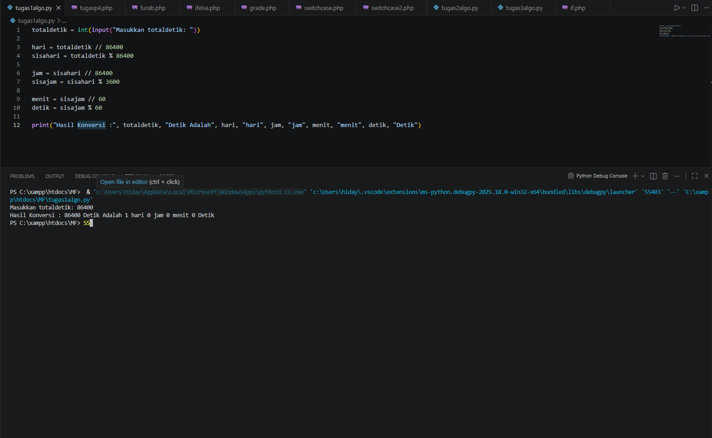
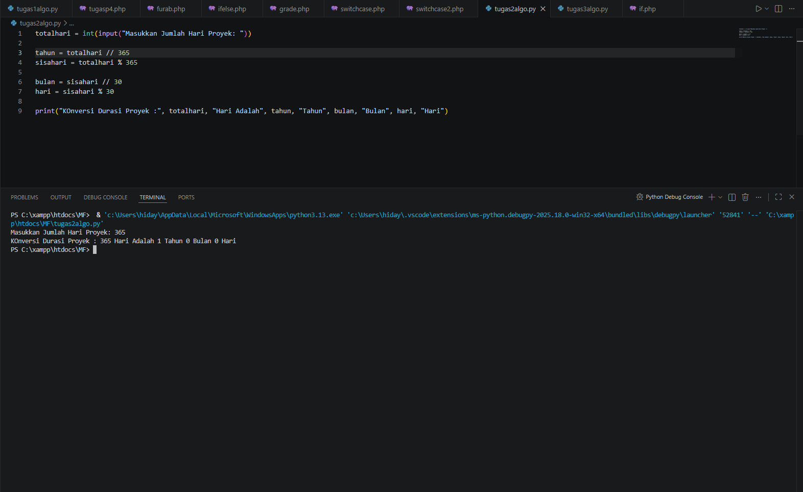
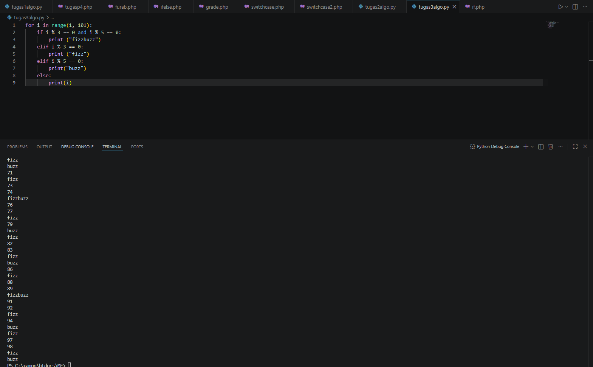

<h1 align="center">🐍 Tugas Python 3</h1>

  Project tugas Python dengan output visual yang menarik 🎨

---

<h2>📖 Deskripsi</h2>

Repository ini berisi kumpulan program Python 3 yang menghasilkan output berupa visual/gambar.
Project ini dibuat untuk memenuhi tugas serta melatih pemahaman dasar Python.

---

<h2>🖼️ Hasil Output</h2>

  
  
  

---

<h2>👨‍🎓 Identitas</h2>
<ul>
  <li>Nama: <b>Mochammad Fakhri Afkar</b></li>
  <li>NIM: <b>251011700743</b></li>
  <li>Kelas: <b>02SIFP012</b></li>
</ul>

---

<h2 align="center">⭐ Terima Kasih ⭐</h2>

  Jangan lupa kasih ⭐ di repository ini ya!

